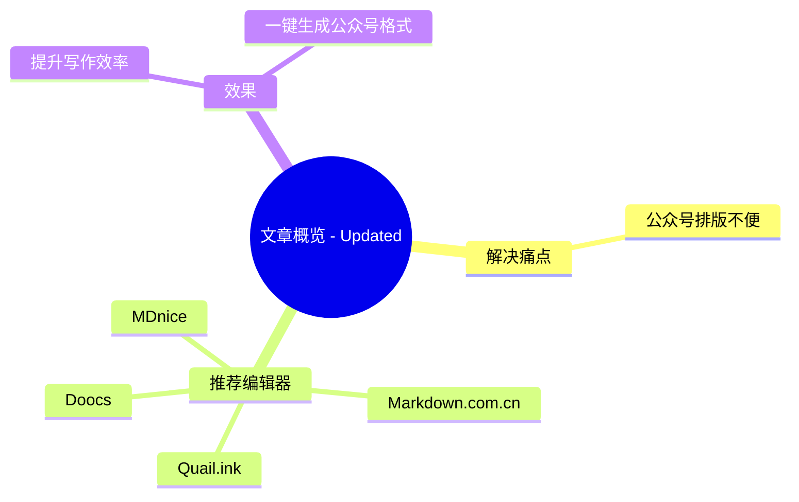

## 前言

作为一名技术博主,经常需要写文章并发布到公众号。但公众号的富文本编辑器功能有限,排版经常让人头疼。好在现在有很多优秀的在线Markdown编辑器,不仅支持Markdown语法,还能一键生成美观的公众号格式。本文就来介绍几个好用的Markdown在线编辑器。

## 推荐编辑器

### 1. Markdown 在线编辑器
- 网址: [https://markdown.com.cn/editor/](https://markdown.com.cn/editor/)
- 特点:
  - 完全免费
  - 提供多种主题选择
  - 支持自定义CSS样式
  - 界面简洁清爽
  - 无需登录即可使用

### 2. Doocs Markdown 编辑器
- 网址: [https://doocs.github.io/md/](https://doocs.github.io/md/)
- 特点:
  - 开源项目,可本地部署
  - 支持自定义主题
  - 可调整字体、颜色等样式
  - 支持一键复制到公众号
  - 支持数学公式、流程图等
  - 提供多种代码高亮主题

### 3. MDnice
- 网址: [https://www.mdnice.com/](https://www.mdnice.com/)
- 特点:
  - 提供丰富的主题模板
  - 支持自定义CSS
  - 文章可在线保存
  - 支持团队协作
  - 需要登录使用

### 4. Quail.ink Markdown 编辑器
- 网址: [https://quail.ink/tools/markdown-to-wx/](https://quail.ink/tools/markdown-to-wx/)
- 特点:
  - 完全免费，无需登录
  - 实时预览效果
  - 自动转换代码格式
  - 自动将外链转为脚注
  - 界面简洁清晰
  - 支持在 Quail 平台同步发布
  - 支持历史文章迁移
  - 完全在线操作，使用便捷

## 使用建议

1. 如果追求简单快速,推荐使用 markdown.com.cn 的编辑器或 Quail.ink，都无需登录即可使用

2. 如果需要经常写作并保存文章,建议使用 MDnice,支持文章管理

3. 如果想要最大程度的自定义,推荐使用 Doocs 编辑器,可以完全控制样式

4. 建议将常用的CSS样式保存下来,方便复用

## 总结

这些Markdown编辑器都能很好地解决公众号排版的痛点,选择一个适合自己的工具能极大提升写作效率。个人比较推荐 Doocs 编辑器,开源免费且功能强大,值得一试。

希望本文的介绍对大家有帮助,祝写作愉快!
