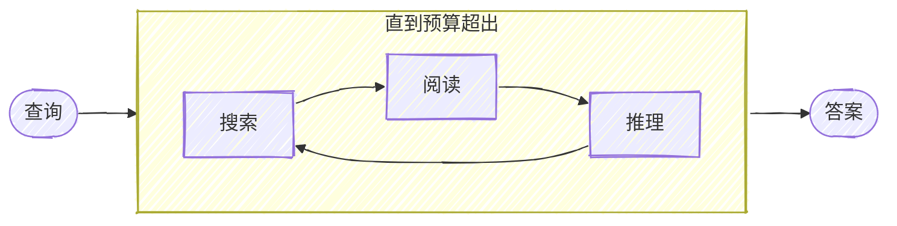

## node-DeepResearch 项目

项目地址：

```
https://github.com/jina-ai/node-deep-research 
```


项目使用了 Gemini 的 API Key，以及 Jina 的 API Key，可以实现类似 deep research 的能力，但是具体还不一样。DeepResearch 项目通过迭代搜索、阅读网页与深度推理，旨在精准回答问题。与 OpenAI 和 Gemini 的 Deep Research 能力不同，这个项目专注于确保答案的准确性，而非生成长篇报告。



## 获取两个 API Key
**获取 Gemini API Key** ，Gemini 2.0 Flash 每天免费 1500 次请求
https://aistudio.google.com/

**获取 Jina API Key** 免费赠送 1 美元额度
https://jina.ai/


## 部署方法

需要先安装 node ，这是 Linux 上，其他环境类似。
```
curl -o- https://raw.githubusercontent.com/nvm-sh/nvm/v0.39.2/install.sh | bash 
source ~/.bashrc
nvm install --lts
```

拉取项目和依赖

```
git clone https://github.com/jina-ai/node-DeepResearch.git
cd node-DeepResearch
npm install
```

设置系统变量：

```
export GEMINI_API_KEY=...  # for gemini
# export OPENAI_API_KEY=... # for openai
# export LLM_PROVIDER=openai # for openai
export JINA_API_KEY=jina_...  # free jina api key, get from 
```


启动，这里为了安全最好设置下 API key
```
npm run serve --secret=xxxx
```


## 使用方法
可以直接调用：

```
curl http://localhost:3000/v1/chat/completions \
  -H "Content-Type: application/json" \
  -H "Authorization: Bearer your_secret_token" \
  -d '{
    "model": "jina-deepsearch-v1",
    "messages": [
      {
        "role": "user",
        "content": "Hello!"
      }
    ],
    "stream": true
  }'
```


可以在 chatwise 里面添加 node-DeepResearch 节点，然后就可以使用 deep research 的能力了。


测试，大部分问题都能回答jina的额度消耗的挺快，1美金，我大概测试了 6-7 问题就快消耗完了，可能是我的大部分问题都比较复杂。

这里放出来一个测试的图，和 o1 Pro 的结果确实差挺多。如果只是为了找答案，目前单纯的网络搜索加上 DeepSeek R1 这种大模型，效果已经不错了。o1 Pro 的效果可以参考：[deep research - 芒格 100 模型——中文信息源](https://views-repeat-sng.craft.me/aA0eW0pzwkzFyI)


## 欢迎关注公众号

{: .d-flex .justify-content-center .w-50}


