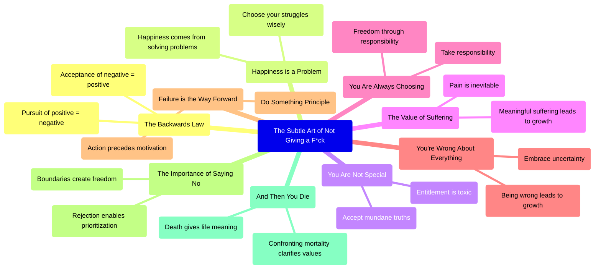
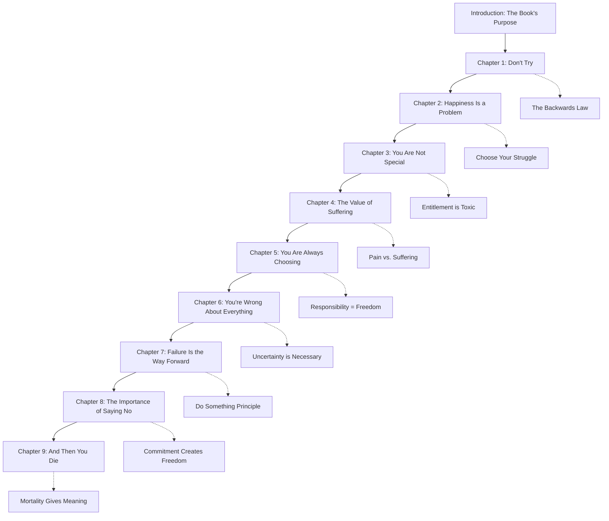
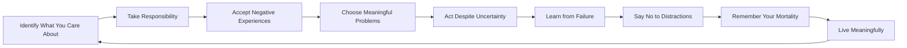

# The Subtle Art of Not Giving a F*ck - Visual Summary

This document provides various visualizations of Mark Manson's book "The Subtle Art of Not Giving a F*ck". Each visualization offers a different perspective on the key concepts and structure of the book.

## Table of Contents
- [Summary](#summary)
- [Mermaid Diagrams](#mermaid-diagrams)
- [SVG Visualization](#svg-visualization)
- [HTML Interactive Version](#html-interactive-version)
- [React Component](#react-component)

## Summary

Mark Manson's "The Subtle Art of Not Giving a F*ck" is a contrarian approach to self-help that focuses on values rather than traditional success metrics. The book argues that the key question isn't how to achieve every goal, but rather what goals are worth pursuing in the first place - what should we truly "give a f*ck" about?

### Key Concepts

1. **The Backwards Law**: The pursuit of positive experience is itself a negative experience, and the acceptance of negative experience is itself a positive experience.

2. **Happiness Is a Problem**: Happiness comes from solving problems, not avoiding them. Negative emotions serve a purpose as signals.

3. **You Are Not Special**: Entitlement creates delusional beliefs that you deserve special treatment without effort.

4. **The Value of Suffering**: Pain and suffering are inevitable, but meaningful suffering leads to growth.

5. **You Are Always Choosing**: Taking responsibility for everything in your life is liberating. When we feel we choose our problems, they become more manageable.

6. **You're Wrong About Everything (But So Am I)**: Our beliefs and "certainties" will likely seem ridiculous in the future. Uncertainty is necessary for growth.

7. **Failure Is the Way Forward**: The "Do Something Principle" teaches that action precedes motivation, not the other way around.

8. **The Importance of Saying No**: Rejecting alternatives is necessary to prioritize what matters. Saying "no" establishes healthy boundaries.

9. **And Then You Die**: Confronting mortality clarifies what truly matters. Death is the ultimate context that gives meaning to our choices.

## Mermaid Diagrams

### Concept Map

### Book Structure Flow

### Value Prioritization Process

## SVG Visualization

The SVG visualization provides a visual representation of the book's key concepts in a radial layout. The central question "What to Give a F*ck About?" is surrounded by the nine chapters, each with their own color and theme.

## HTML Interactive Version

For an interactive experience, open the HTML file in your browser:

[Open HTML Visualization](The%20Subtle%20Art%20of%20Not%20Giving%20a%20F*ck%20-%20Visualization.html)

The HTML version includes:
- An SVG diagram of the book's structure
- A Mermaid flowchart showing relationships between concepts
- Detailed explanations of key concepts
- Responsive design for different screen sizes

## React Component

For web developers, a React component is available that provides an interactive visualization of the book's concepts:

[View React Component](The%20Subtle%20Art%20of%20Not%20Giving%20a%20F*ck%20-%20React.jsx)

Features of the React component:
- Interactive chapter selection
- Dynamic display of chapter details
- Visual relationships between concepts
- Responsive design
- Customizable styling

---

These visualizations are based on Mark Manson's "The Subtle Art of Not Giving a F*ck" and are intended for educational purposes.
