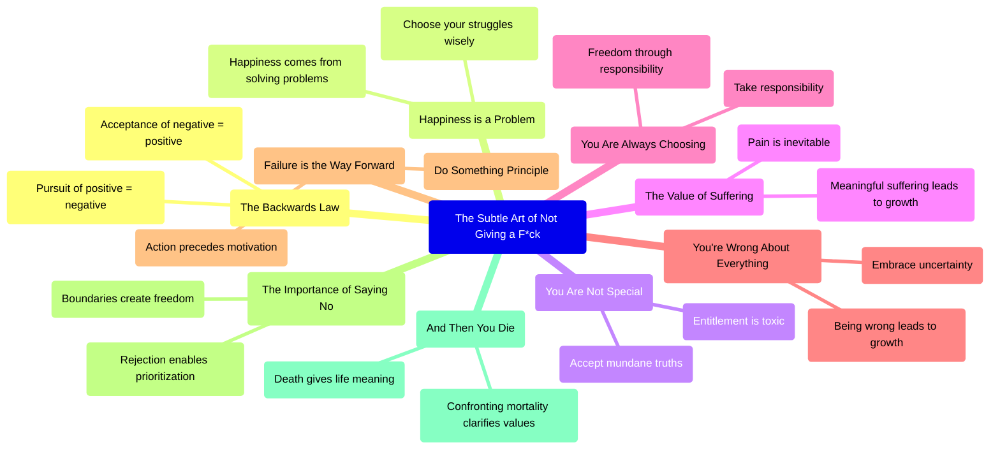
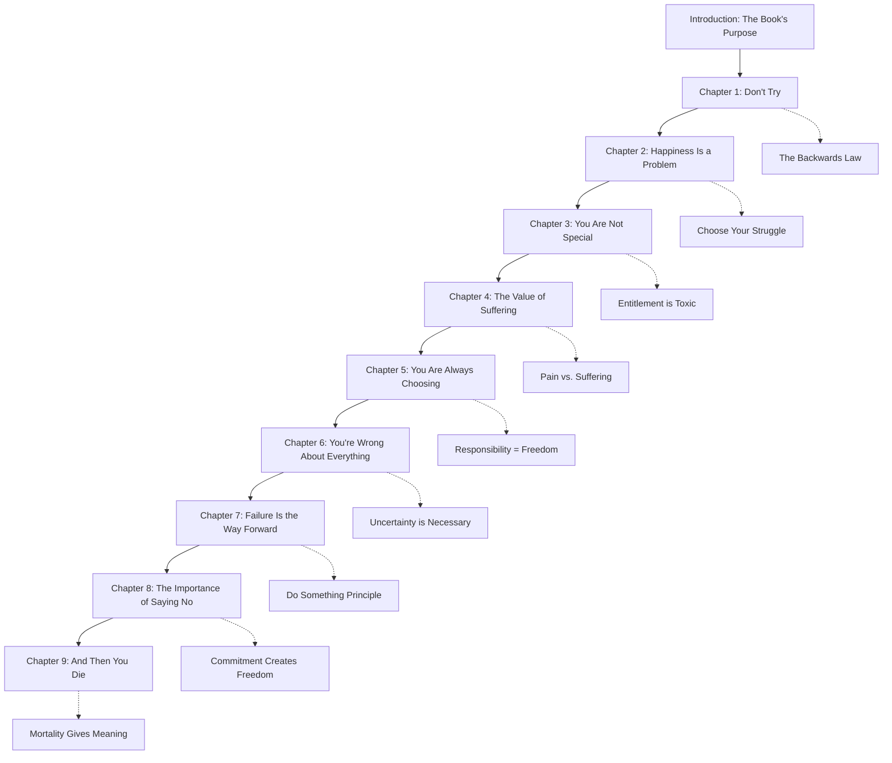
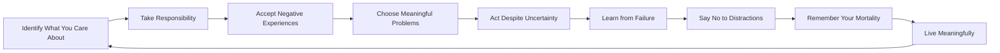
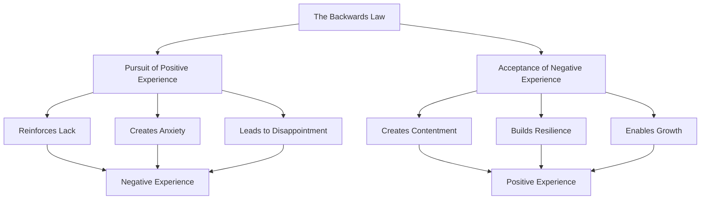
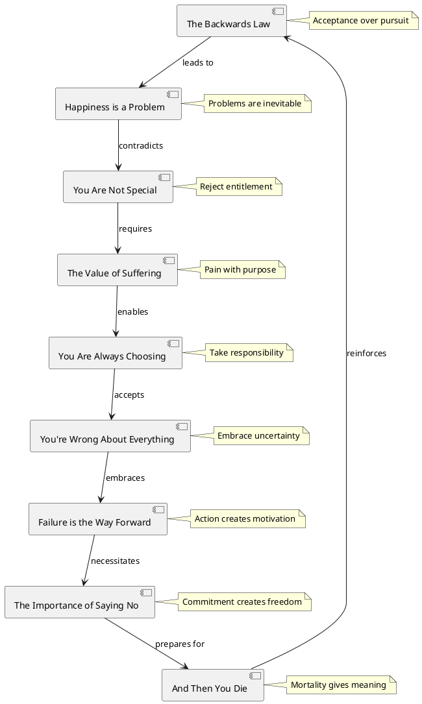

# The Subtle Art of Not Giving a F*ck - Visual Diagrams

## Concept Map

## Book Structure Flow

## Value Prioritization Process

## The Backwards Law Explained

## PlantUML Diagram: Core Concepts Relationship

