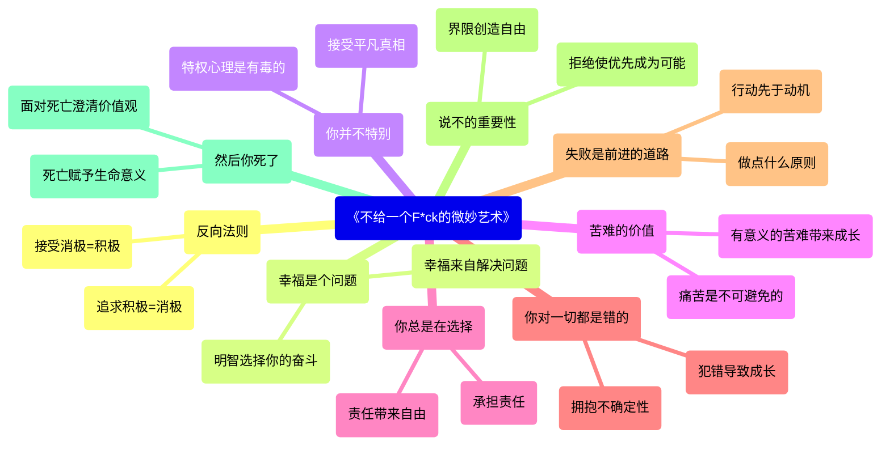
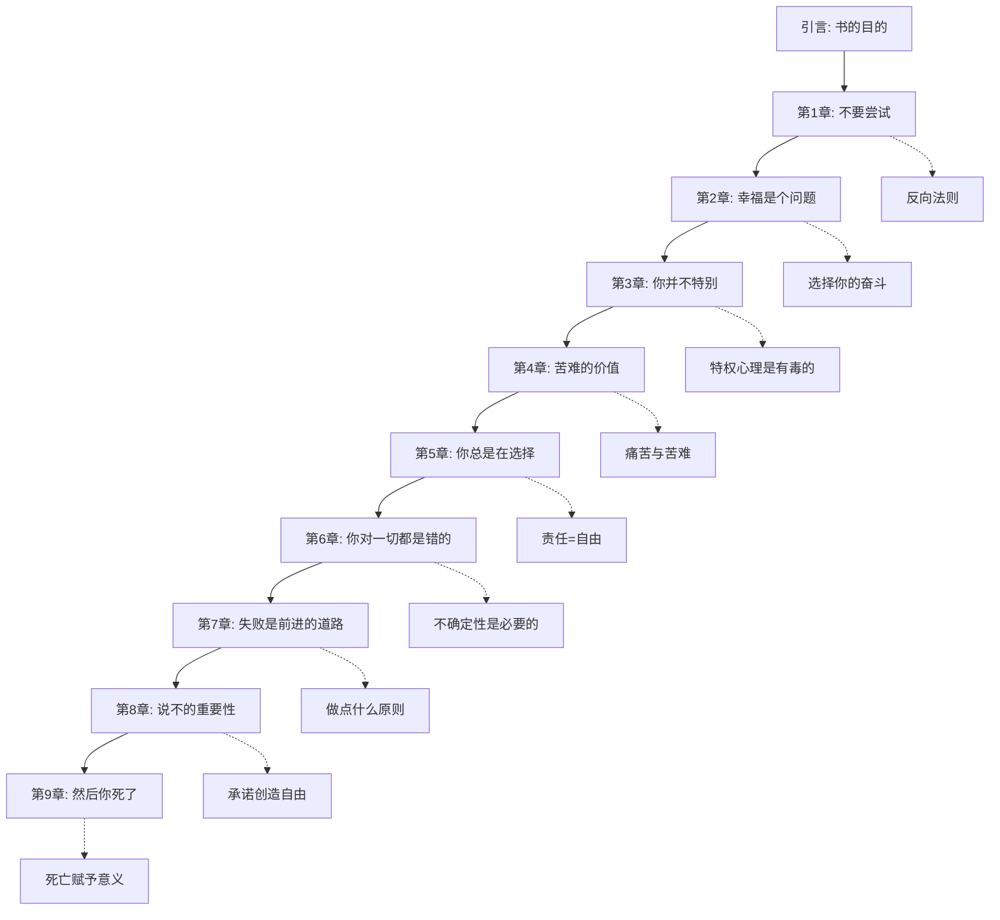
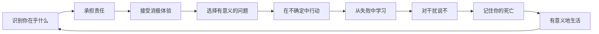
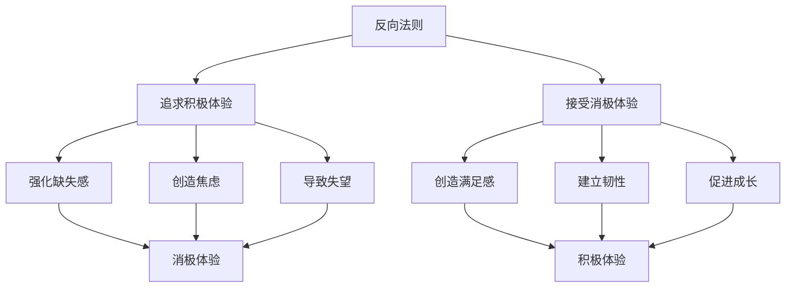
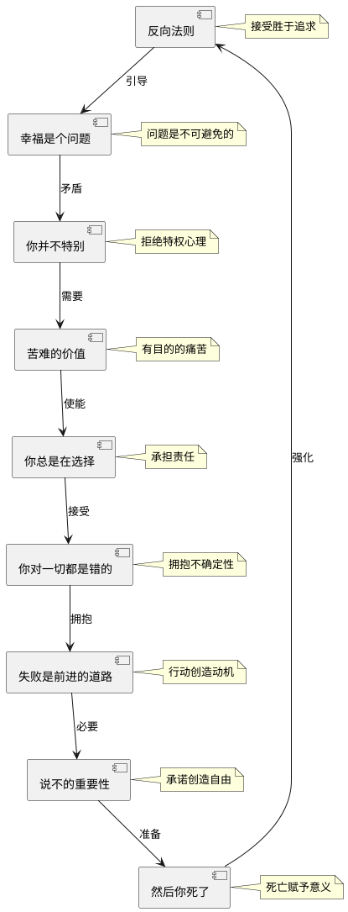

# 《不给一个F*ck的微妙艺术》- 可视化图表

## 概念图

```mermaid
mindmap
  root("《不给一个F*ck的微妙艺术》")
    ("反向法则")
      ("追求积极=消极")
      ("接受消极=积极")
    ("幸福是个问题")
      ("幸福来自解决问题")
      ("明智选择你的奋斗")
    ("你并不特别")
      ("特权心理是有毒的")
      ("接受平凡真相")
    ("苦难的价值")
      ("痛苦是不可避免的")
      ("有意义的苦难带来成长")
    ("你总是在选择")
      ("承担责任")
      ("责任带来自由")
    ("你对一切都是错的")
      ("拥抱不确定性")
      ("犯错导致成长")
    ("失败是前进的道路")
      ("做点什么原则")
      ("行动先于动机")
    ("说不的重要性")
      ("拒绝使优先成为可能")
      ("界限创造自由")
    ("然后你死了")
      ("死亡赋予生命意义")
      ("面对死亡澄清价值观")
```

## 书籍结构流程图

```mermaid
graph TD
    A[引言: 书的目的] --> B[第1章: 不要尝试]
    B --> C[第2章: 幸福是个问题]
    C --> D[第3章: 你并不特别]
    D --> E[第4章: 苦难的价值]
    E --> F[第5章: 你总是在选择]
    F --> G[第6章: 你对一切都是错的]
    G --> H[第7章: 失败是前进的道路]
    H --> I[第8章: 说不的重要性]
    I --> J[第9章: 然后你死了]
    
    B -.-> K[反向法则]
    C -.-> L[选择你的奋斗]
    D -.-> M[特权心理是有毒的]
    E -.-> N[痛苦与苦难]
    F -.-> O[责任=自由]
    G -.-> P[不确定性是必要的]
    H -.-> Q[做点什么原则]
    I -.-> R[承诺创造自由]
    J -.-> S[死亡赋予意义]
```

## 价值观优先级过程

```mermaid
flowchart LR
    A[识别你在乎什么] --> B[承担责任]
    B --> C[接受消极体验]
    C --> D[选择有意义的问题]
    D --> E[在不确定中行动]
    E --> F[从失败中学习]
    F --> G[对干扰说不]
    G --> H[记住你的死亡]
    H --> I[有意义地生活]
    I --> A
```

## 反向法则解释

```mermaid
graph TD
    A[反向法则] --> B[追求积极体验]
    A --> C[接受消极体验]
    
    B --> D[强化缺失感]
    B --> E[创造焦虑]
    B --> F[导致失望]
    
    C --> G[创造满足感]
    C --> H[建立韧性]
    C --> I[促进成长]
    
    D --> J[消极体验]
    E --> J
    F --> J
    
    G --> K[积极体验]
    H --> K
    I --> K
```

## PlantUML图表: 核心概念关系

```plantuml
@startuml
skinparam backgroundColor transparent
skinparam componentStyle uml2

component "反向法则" as BL
component "幸福是个问题" as HP
component "你并不特别" as NS
component "苦难的价值" as VS
component "你总是在选择" as AC
component "你对一切都是错的" as WE
component "失败是前进的道路" as FF
component "说不的重要性" as SN
component "然后你死了" as TD

BL --> HP : 引导
HP --> NS : 矛盾
NS --> VS : 需要
VS --> AC : 使能
AC --> WE : 接受
WE --> FF : 拥抱
FF --> SN : 必要
SN --> TD : 准备
TD --> BL : 强化

note right of BL : 接受胜于追求
note right of HP : 问题是不可避免的
note right of NS : 拒绝特权心理
note right of VS : 有目的的痛苦
note right of AC : 承担责任
note right of WE : 拥抱不确定性
note right of FF : 行动创造动机
note right of SN : 承诺创造自由
note right of TD : 死亡赋予意义
@enduml
```
