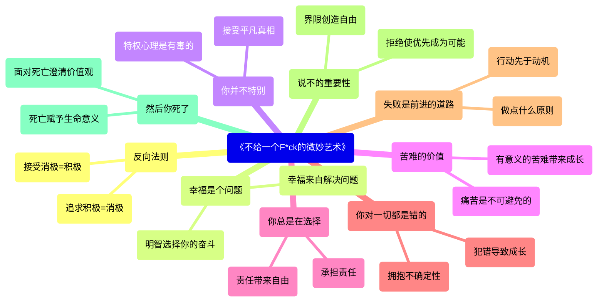
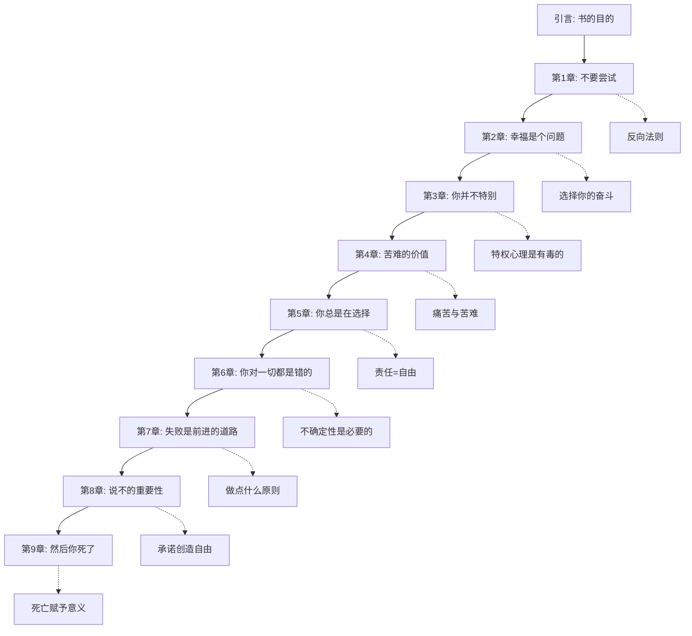
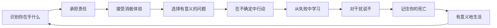

# 《不给一个F*ck的微妙艺术》- 可视化总结

本文档提供了马克·曼森的《不给一个F*ck的微妙艺术》的各种可视化。每种可视化都从不同角度展示了书中的关键概念和结构。

## 目录
- [总结](#总结)
- [Mermaid图表](#mermaid图表)
- [SVG可视化](#svg可视化)
- [HTML交互版本](#html交互版本)
- [React组件](#react组件)

## 总结

马克·曼森的《不给一个F*ck的微妙艺术》是一种与传统自助书籍相反的方法，它关注价值观而非传统的成功指标。这本书认为，关键问题不是如何实现每一个目标，而是首先要确定哪些目标值得追求——我们应该真正"在乎"什么？

### 核心概念

1. **反向法则**：追求积极体验本身就是一种消极体验，而接受消极体验本身就是一种积极体验。

2. **幸福是个问题**：幸福来自于解决问题，而不是避免问题。负面情绪作为信号有其用处。

3. **你并不特别**：特权心理会创造出妄想，让你认为自己应该得到特殊待遇而不需要付出努力。

4. **苦难的价值**：痛苦和苦难是不可避免的，但有意义的苦难会带来成长。

5. **你总是在选择**：对生活中的一切负责会让人感到解脱。当我们感觉是我们选择了自己的问题时，这些问题就变得更容易管理。

6. **你对一切都是错的（但我也是）**：我们的信念和"确定性"在未来可能看起来很荒谬。不确定性对成长是必要的。

7. **失败是前进的道路**："做点什么原则"教导我们，行动先于动机，而不是相反。

8. **说不的重要性**：拒绝其他选择是优先考虑重要事项的必要条件。说"不"建立了关系中的健康界限。

9. **然后你死了**：面对死亡能澄清什么才是真正重要的。死亡是赋予我们选择意义的终极背景。

## Mermaid图表

### 概念图

### 书籍结构流程图

### 价值观优先级过程

## SVG可视化

SVG可视化以放射状布局展示了书中的关键概念。中心问题"值得在乎什么？"被九个章节所环绕，每个章节都有自己的颜色和主题。

## HTML交互版本

要获得交互式体验，请在浏览器中打开HTML文件：

[打开HTML可视化](The%20Subtle%20Art%20of%20Not%20Giving%20a%20F*ck%20-%20中文可视化.html)

HTML版本包括：
- 书籍结构的SVG图表
- 显示概念之间关系的Mermaid流程图
- 关键概念的详细解释
- 适应不同屏幕尺寸的响应式设计

## React组件

对于Web开发者，提供了一个React组件，它提供了书籍概念的交互式可视化：

[查看React组件](The%20Subtle%20Art%20of%20Not%20Giving%20a%20F*ck%20-%20中文React.jsx)

React组件的特点：
- 交互式章节选择
- 动态显示章节详情
- 概念之间的视觉关系
- 响应式设计
- 可定制的样式

---

这些可视化基于马克·曼森的《不给一个F*ck的微妙艺术》，仅供教育目的使用。
